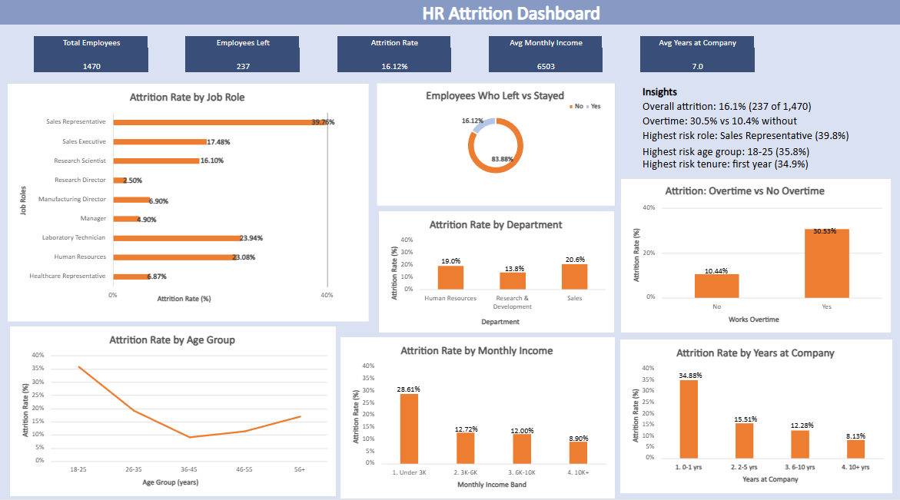

<div align="center">

# 📊 HR Attrition Dashboard (Excel)

An Excel dashboard that explores **why and where employees leave**, built with data cleaning checks, helper columns, PivotTables and charts.


<!-- Add your dashboard screenshot in an "images" folder and keep this name -->


</div>

---

## 🎯 Project Overview

Employee attrition is costly for any company. This project analyzes an HR dataset to answer:

1. What is the overall attrition rate?
2. Which departments and job roles lose the most employees?
3. Does overtime relate to higher attrition?
4. How do age, income and years at the company relate to attrition?

## 📁 Dataset

- **Name:** IBM HR Analytics Employee Attrition & Performance
- **Size:** 1,470 employees, 35 columns
- **Note:** This is a **fictional sample dataset** created by IBM data scientists for practice. It does not represent a real company.

## 🛠️ Tools

- Microsoft Excel (Excel for the web): Tables, formulas, PivotTables, charts, dashboard design

## 🔧 What I Did

1. **Checked data quality:** no missing values and no duplicate employees (checked using `EmployeeNumber`).
2. **Removed non-informative columns:** `EmployeeCount`, `Over18` and `StandardHours` had the same value for every employee.
3. **Created helper columns:**
   - `Attrition Flag` (Yes = 1, No = 0)
   - `Age Group`, `Income Band`, `Tenure Band`
   - Readable labels for satisfaction and work-life balance scores
4. **Built PivotTables** showing attrition rate by department, job role, overtime, age group, income band and tenure band.
5. **Created charts and a dashboard** with KPI cards and a clean layout.
6. **Recorded every step** in a cleaning log.

## 📈 Key Metrics

| Metric | Value |
|--------|-------|
| Total employees | 1,470 |
| Employees who left | 237 |
| Overall attrition rate | 16.1% |
| Average monthly income | 6,503 |
| Average years at company | 7.0 |

## 🔍 Key Insights

| # | Finding | Suggestion |
|---|---------|------------|
| 1 | Employees who work overtime leave far more often (30.5% vs 10.4% for those who do not). | Review overtime workload and shift planning. |
| 2 | Sales Representatives have the highest attrition (about 40%), while Research Directors have the lowest (2.5%). | Look into pay, targets and support for sales representatives. |
| 3 | The youngest group (18-25) leaves most often (35.8%), while ages 36-45 leave least (9.2%). | Improve onboarding and career growth for young employees. |
| 4 | Lower income relates to higher attrition (28.6% under 3K vs 8.9% above 10K). | Review compensation for the lowest income band. |
| 5 | Attrition is highest in the first year (34.9%) and falls as tenure grows. | Strengthen the first-year employee experience. |

> **Note:** These patterns show relationships in the data, not proven causes. Some groups are small (for example, 63 employees in Human Resources), so their rates should be read with care.

## 📂 Repository Structure

```
hr-attrition-excel-dashboard/
├── HR_Attrition_Analysis.xlsx
├── images/
│   └── dashboard.png
└── README.md
```

## 📌 Workbook Sheets

| Sheet | Purpose |
|-------|---------|
| Raw Data | Original dataset, untouched |
| Clean Data | Cleaned table with helper columns |
| Pivots | All PivotTables |
| Dashboard | KPI cards and charts |
| Cleaning Log | Record of checks and changes |

## 🚀 Possible Next Steps

- [ ] Rebuild the dashboard in Power BI
- [ ] Add a SQL version of the analysis
- [ ] Use Python (Pandas) to repeat the analysis
- [ ] Study satisfaction and work-life balance in more depth

## 👤 Author

**Tanzeela Nawaz**
BS Bioinformatics Student | Aspiring Data Analyst

[](https://www.linkedin.com/in/tanzeela-nawaz-405376418)
[](https://github.com/tanzeelanawaz700-design)

---

<div align="center">⭐ If you found this useful, give it a star!</div>
